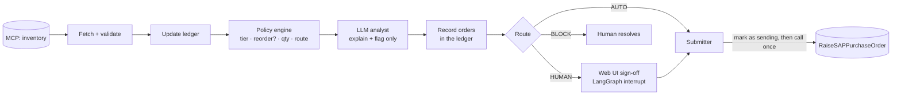

# Reorder Agent: blueprint

An agent that reads inventory through MCP (Model Context Protocol), decides **what** to reorder and **how much**,
explains every decision, gets a human to sign off on the orders that matter, and raises purchase orders in SAP
**without ever ordering the same part twice**. Built for Lato (bicycles, 23 parts, 9 models) and written to be reused.

**Use this pattern when** an agent's actions commit money or are hard to undo, the rules must be defensible to an
auditor, and the input data is incomplete (here: no cost, demand or lead-time data). **Don't use it** when a
wrong action is cheap and reversible: a plain LLM tool loop is simpler there.

## How it works



1. **Policy engine (plain code).** Every part gets a tier, a decision on whether to reorder, a quantity and an
   approval route, each with the rule IDs that produced it and a step-by-step derivation.
2. **LLM analyst (Claude Haiku 4.5, structured output).** Explains each decision for the approver and flags what
   code can't see ("discontinued" in a description, a wheel counted once per bike, instructions hidden in data).
   It can escalate a line to a human; it can never change a quantity, a route or a part name. Its
   [system prompt](prompts/analyst_system.md.j2) is rendered from the policy file, so prompt and engine can't drift.
3. **Ledger (SQLite).** The database that records every order and its status: one open order per part (enforced by
   the database), status changes that only succeed if the order is still in the expected state (compare-and-set), and
   a history of every change that can't be edited.
4. **Human in the loop.** A LangGraph `interrupt()` pauses the run; the approver approves, edits (with a reason)
   or rejects each line in a small web UI; "Submit approved" resumes it.

## The reorder policy

A part matters by **impact × urgency**.

| | Rule |
|---|---|
| **Impact** | Fan-out *f*: how many bike models stop if the part runs out. With no demand data, it also stands in for consumption. |
| **Tier** | **CRITICAL**: used by ≥ 50% of models, 1 cycle of safety stock. **SHARED**: 2+ models, ½ cycle. **SINGLE**: 1 model, none. |
| **Demand per cycle** | *D = K × units-per-bike × f*. *K* (builds per model per cycle) is an assumption, set to 5 at calibration. |
| **When to order** | When *on hand + on order ≤ (1 + safety) × D* (the reorder point). |
| **How much** | Enough to reach *(2 + safety) × D* (the order-up-to level). |

**On the live data:** the fork (16 in stock, all 9 models) has *D* = 5 × 1 × 9 = 45, a reorder point of 90 and an
order-up-to level of 135, so it gets **119** and goes to a human. The derailleur with the **lowest** stock (7, one
model) has a reorder point of 5, so it is *not* ordered: low stock alone doesn't make a part critical.

**Routing** (strictest wins, BLOCK > HUMAN > AUTO):
- **AUTO:** small orders of non-critical parts, in stock and unflagged, within 5 POs / 300 units per run.
- **HUMAN:** critical parts, stockouts, orders over 100 units, anything flagged, anything the LLM raises a concern
  about, and anything over the per-run budget.
- **BLOCK:** invalid data, an order above 300 units, or a part with an unresolved earlier PO.

These limits are settings in `policy.yaml`, not constants: 100 sits above the largest non-critical order (66); 300
is about 2× the largest order-up-to level (135), because the SAP tool itself accepted a 1,000,000-unit order; the
per-run budget caps what goes out unattended. [CALIBRATION.md](docs/CALIBRATION.md) records each choice.

**When it runs:** once per review cycle on a schedule (cron, a Mendix Scheduled Event), plus an on-demand "Start a
new run" button. Extra runs are safe: the ledger means a second run orders nothing new.

## Key decisions and trade-offs

| Decision | Why | Trade-off |
|---|---|---|
| **Code decides, the LLM explains.** Tier, quantity and route come only from data + `policy.yaml`. | Money maths must give the same answer every time and be testable. With the LLM off, orders are identical. | The LLM's judgement goes into concerns that route to a human, not into quantities. |
| **The LLM can only escalate.** `final_route = max(engine, HUMAN if concern)`. | A wrong concern costs a human a minute; a wrong lowering could place a bad order. | Some unneeded notes: about one every two runs, none sent to a human. |
| **Structured output + validators.** Closed enums; the model repeats the engine's numbers; every number must come from the input; every concern must quote the data. One retry, then a fixed template and a human. | "Consistent with the rules" becomes checkable. | About 5% of first answers are retried; prompt changes need an eval run. |
| **Inventory position = on hand + open orders from the ledger.** | The sandbox PO tool doesn't change stock, so a rule on stock alone re-orders forever. | The ledger must be trusted and reconciled. |
| **Save "sending" before calling SAP; never retry once sent.** A timeout becomes UNKNOWN and blocks the part. Approvals bind to the exact order and expire in 24 h. | A duplicate PO is worse than a delayed one. | Rare manual checks in SAP. |
| **LangGraph for the pause, the ledger for the truth.** | The pause survives a restart; re-running a step can't send an order twice. | Two stores to understand. |
| **Small model (Haiku 4.5).** | Explanation within tight guardrails; evals pass at about $0.15 per run. | Needs the validators; a bigger model is a one-line switch. |

Everything above is tested: 136 tests (unit, property-based, fault-injection against a fake MCP server), a
19-case LLM eval suite with 5 prompt-injection cases (`tests/evals/`), and a recorded end-to-end
[sandbox run](docs/sample_run/README.md).

## Adapting it to another customer or domain

| Change | Where |
|---|---|
| Thresholds, safety cover, caps, auto budget, *K* | `config/policy.yaml`, then `lato calibrate` and business sign-off |
| Units per product (e.g. 2 wheels per bike) | `config/bom_overrides.yaml` |
| Real demand, lead time or cost data | Replace *D = K·q·f* in `policy/maths.py`; add a cost cap to routing |
| Different source system or ERP | `mcp_gateway/` and `execution/confirmation.py` (parse the ERP's reply) |
| Approver identity | SSO and a Procurement role instead of the configured name |
| Different LLM | `LATO_LLM_MODEL`, then re-run the evals |

### Reusing the architecture

Five building blocks carry over to any agent that must take a money-committing action exactly once:

| Building block | Code | Reuse |
|---|---|---|
| MCP client with a tool-contract check | `mcp_gateway/` | As is; change tool and field names |
| Policy engine: data in → decision, rule IDs and derivation out | `policy/` | Keep the shape, replace the rules |
| LLM analyst: trusted facts vs untrusted text, structured output, validators, escalate-only, template fallback | `llm/`, `prompts/` | As is; rewrite the prompt wording and eval cases |
| Ledger + write-ahead submit: one open action per item, compare-and-set, UNKNOWN, re-check before sending | `ledger/`, `execution/` | As is |
| Approval pause and UI | `orchestrator/`, `approval/` | As is, or a Mendix Workflow and task inbox |

Examples: refunds, supplier payments, maintenance work orders. The rules change; the ledger, the submit protocol,
the human routing and the escalate-only LLM stay.

## Known limits and next steps

- *K* is an assumption. Next: measure consumption from the stock recorded in each run's saved plan.
- One process, one SQLite ledger; multi-instance needs a shared database (the constraints move as is).
- The sandbox can't confirm receipt of goods; receipts are inferred from stock rising or marked by hand.
- The eval set is hand-written; in production, feed every fallback and approver override back in as cases.
- With more data: cost caps, per-supplier lead times, crate rounding.

## Run it

```bash
uv sync && cp .env.example .env          # add MCP credentials and ANTHROPIC_API_KEY
uv run lato plan --llm none              # preview from captured data: every part explained, no orders
uv run lato serve                        # approver UI on http://127.0.0.1:8000
uv run pytest                            # 136 tests, no network
```
